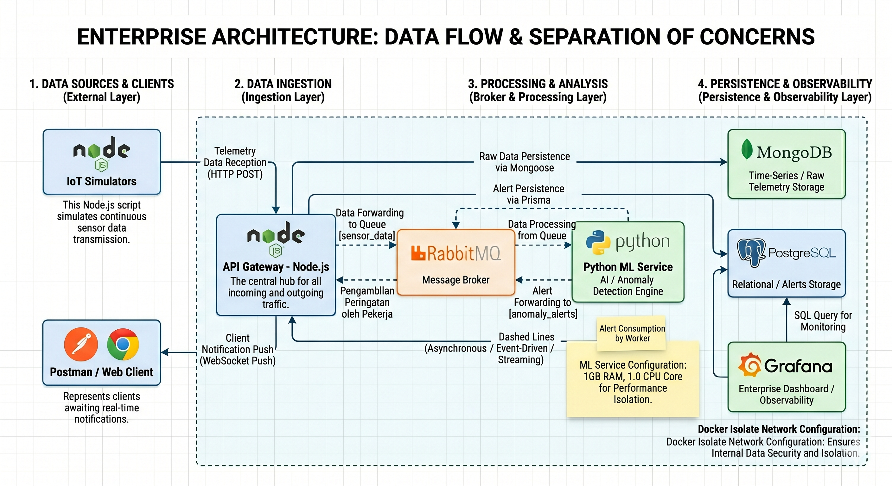

# 🏭 Predictive Maintenance Microservices Platform

An enterprise-grade, event-driven, and distributed AI-powered Predictive Maintenance IoT platform. This system ingests high-frequency telemetry data from industrial equipment, processes it asynchronously via a message broker, executes real-time machine learning anomaly detection, and streams live operational alerts to an observability dashboard.

---

## 🏗️ System Architecture Overview

The system is built on an **Event-Driven Architecture (EDA)** using microservices containerized with Docker, isolating responsibilities and ensuring high scalability and fault tolerance.

<!-- Ganti nama 'architecture.png' di bawah ini dengan nama file gambar diagram yang Anda unggah ke GitHub -->



### 🔁 Data Flow Pipeline:

1. **Ingestion:** IoT Devices send high-frequency telemetry data (Temperature, RPM, Vibration) to the **API Gateway** via `HTTP POST`.
2. **Buffering & Streaming:** The API Gateway caches raw streams into **MongoDB** and publishes messages to the **RabbitMQ** `sensor_data` queue.
3. **AI Processing:** The **ML Service (Python)** consumes messages asynchronously, runs anomaly detection models, and writes predictions back to MongoDB.
4. **Alert Broadcast:** If an anomaly is critical, the ML Service publishes an alert payload to the `anomaly_alerts` queue.
5. **Real-Time Consumer:** The API Gateway's background worker consumes the alerts, persists them into **PostgreSQL** via Prisma ORM, and immediately pushes them to subscribed clients via **Socket.IO**.
6. **Observability:** **Grafana** continuously polls PostgreSQL to render high-level executive KPIs, time-series anomaly frequencies, and granular investigation logs.

---

## 🧠 Enterprise Problems Solved

This architecture was specifically engineered to solve critical bottlenecks common in large-scale industrial IoT deployments:

- **Traffic Spikes & Bottlenecks (Backpressure Management):** High-frequency sensor data can overwhelm traditional REST APIs. By implementing **RabbitMQ** as a message broker, the API Gateway instantly offloads ingestion traffic to a queue, decoupling the data reception from the heavy AI computation and preventing server timeouts.
- **The Wrong Tool for the Job (Separation of Concerns):** Instead of forcing a monolithic approach, this system leverages Node.js (non-blocking I/O) exclusively for high-concurrency network routing and WebSocket broadcasting, while isolating CPU-intensive mathematical operations (Machine Learning) within a dedicated Python container.
- **Database Lock & Bloat (Polyglot Persistence):** Storing unstructured, high-velocity time-series data in a relational database causes severe indexing lag. This architecture utilizes **MongoDB** for rapid, schema-less raw telemetry ingestion, reserving **PostgreSQL** strictly for high-integrity structured relational data (such as Machine Profiles and Critical Alerts).
- **The Noisy Neighbor Problem (Resource Isolation):** AI models can aggressively consume host server RAM. Hard resource limits (CPU and Memory caps) are enforced via Docker Compose to ensure the ML Service cannot crash the Database or API Gateway containers due to memory leaks.
- **Operational Blind Spots (Observability Pipeline):** Terminal logs are converted into actionable business value through **Grafana**, providing plant managers with real-time visual dashboards and drill-down audit logs without requiring CLI access.

---

## 🛠️ Tech Stack & Service Breakdown

| Service            | Technology                           | Port Map        | Core Responsibility                                                                |
| :----------------- | :----------------------------------- | :-------------- | :--------------------------------------------------------------------------------- |
| **API Gateway**    | Node.js, Express, Socket.IO, Prisma  | `3000:3000`     | Traffic routing, client authentication, WebSocket management, and alert ingestion. |
| **ML Engine**      | Python, FastAPI, Scikit-learn / LSTM | `8000:8000`     | Asynchronous telemetry stream evaluation, anomaly detection scoring.               |
| **Message Broker** | RabbitMQ                             | `5672`, `15672` | Message queuing, load smoothing, inter-service events.                             |
| **TS DB**          | MongoDB                              | `27017:27017`   | Storage of high-throughput unstructured raw time-series sensor data.               |
| **Relational DB**  | PostgreSQL                           | `5435:5432`     | Storage of structural asset definitions, operational logs, and system alerts.      |
| **Observability**  | Grafana                              | `3001:3000`     | Real-time monitoring, threshold alerts mapping, trend analysis dashboard.          |

---

## 🚀 Getting Started & Deployment

### Prereqs:

- Docker & Docker Compose (v2.x+)
- Node.js v18+ / Python 3.10+ (for local workspace development)

### 1. Environment Configuration

Create a `.env` file in the project root to securely manage database credentials and Grafana access.

### 2. Bootstrap Architecture Containers

Run Docker Compose to build images, instantiate internal bridge network boundaries (`pm_network`), mount data volumes, and initialize services:

```bash
docker-compose up -d --build
```

### 3. Run Database Migrations (Prisma)

Initialize your relational entities inside the isolated PostgreSQL container:

```bash
cd api-gateaway
npx prisma migrate dev --name init
```

### 4. Execute Real-Time IoT Sensor Simulator

To start streaming high-frequency machinery status into the infrastructure ecosystem:

```bash
node simulator.js
```

---

## 📈 Enterprise Observability Dashboard (Grafana)

- **Access Endpoint:** `http://localhost:3001`
- **Features:** Executive Scorecard, Operational Trend Analysis, and Drill-down Audit Hub for real-time `CRITICAL` alerts.

---

## 🛡️ Production Resource Constraint Allocations

To prevent host server instability during heavy ML computational loads, hard kernel limits are enforced within `docker-compose.yml`:

- **ML Service:** Max `1.0` CPU Core, `1GB` RAM limit.
- **Grafana:** Max `0.5` CPU Core, `512MB` RAM limit.

---

_Architected and developed independently as a showcase of high-scalability backend engineering and AI integration._
